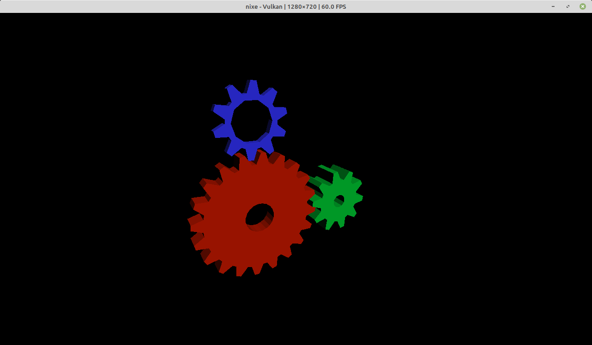
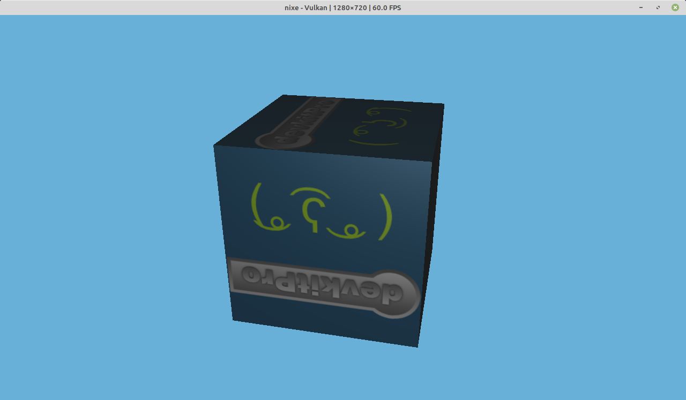

# Nixe

This is an educational and experimental project written in Rust. Its long-term goal is to research and build
functional emulators for Nintendo Switch and Nintendo Switch 2 while sharing well-defined components between
both platforms whenever technically appropriate.

## Goals

- Study modern console emulation and low-level systems programming.
- Build a functional Nintendo Switch emulator incrementally.
- Prepare an extensible foundation for Nintendo Switch 2 research and emulation.
- Reuse CPU, memory, graphics, tooling, and other infrastructure when the underlying behavior is genuinely
  shared.
- Favor testable, documented, and maintainable Rust code.

## Project Status

The project is in active development. Some homebrew applications run at up to 60 FPS, and gamepad input is
supported through the emulated HID services.

### Screenshots

<table>
  <tr>
    <td></td>
    <td></td>
  </tr>
</table>

## JIT compiler

Nixe's tiered JIT translates guest AArch64 instructions using a customized
[Cranelift](https://cranelift.dev/) backend. LCQ compiles blocks on demand with
minimal optimization; HCQ compiles hot regions with stronger optimization in
background workers. Native links connect compiled
units across both tiers without returning to Rust on each block transition.
Nixe manages code replacement, invalidation and safe reclamation within a
bounded code-and-metadata cache.

Our Cranelift fork adds:

- A custom native ABI with reserved registers and fixed-frame spills, avoiding
  per-block host-stack setup and teardown.
- Multiple independent entry points into a shared optimized body.
- Precise guest-state maps after register allocation for state transfer and
  fault recovery, with constant locations and explicit subtraction-flag
  contracts at eligible exits.
- Patchable exits, execution-budget checkpoints and exact faulting-instruction
  metadata for native linking and controlled exits.
- Preservation of observable floating-point effects during optimization, plus
  atomic lowering fixes and extensions required by guest memory semantics.

The fork retains Cranelift's optimizers, register allocators and machine-code
backends. It is published on the
[Wasmtime fork's `nixe` branch](https://github.com/pladaria/wasmtime/tree/nixe),
with the exact revision pinned in `Cargo.lock`; no local override is required.
See the [tiered JIT design](docs/specs/tiered-jit/spec.md) and
[Cranelift modifications](docs/cranelift-modifications.md) for details.

## Running

See [host requirements](docs/host-requirements.md) for required CPU and memory
capabilities. `--offline` is optional once dependencies are cached.

The default configuration is in [`nixe.toml`](nixe.toml). List available titles with:

```bash
cargo cli list
```

Run a title by its ID or name:

```bash
cargo cli run <id | name>
```

## Testing

Run

```
cargo test-all
```

### Integration tests against real titles

To run integration tests against caller-owned titles, copy `.env.integration.example` to
`.env.integration`, configure the paths, and run `./scripts/test-integration.sh`.

### Differential tests

Optional CPU differential tests require QEMU user-mode (`qemu-aarch64`), the Rust
`aarch64-unknown-linux-gnu` target, and its cross-linker.

```bash
sudo apt update && sudo apt install qemu-user gcc-aarch64-linux-gnu
rustup target add aarch64-unknown-linux-gnu
```

Verify with

```bash
qemu-aarch64 --version
aarch64-linux-gnu-gcc --version
```

Then run

```bash
cargo test-diff
```

To run a fast, focused A64 differential test for one instruction family or coverage ID, use:

```bash
NIXE_DIFF_FAMILY=simd-duplicate-element cargo test-diff-a64
NIXE_DIFF_COVERAGE_ID=0x8c cargo test-diff-a64
```

### Fuzz tests

CPU decoder and memory fuzz targets require a nightly Rust toolchain
and `cargo-fuzz`:

```bash
rustup toolchain install nightly
cargo install cargo-fuzz
cargo fuzz-all
```

See [fuzz/README.md](fuzz/README.md) for target-specific commands and configuration.

## Contributing

See [CONTRIBUTING.md](CONTRIBUTING.md).

## Legal Notice

This project is intended for lawful education, research, interoperability, and preservation work. It does not
provide or distribute games, firmware, cryptographic keys, copyrighted console files, or leaked confidential
material.

Users and contributors are responsible for complying with the laws applicable in their jurisdictions and for
using only software and data they are legally entitled to use.

Nintendo Switch and Nintendo Switch 2 are trademarks of Nintendo. This project is independent and is not
affiliated with, sponsored by, or endorsed by Nintendo or NVIDIA.

## License

Nixe is licensed under the GNU General Public License version 3 or later. See [LICENSE.txt](LICENSE.txt).
