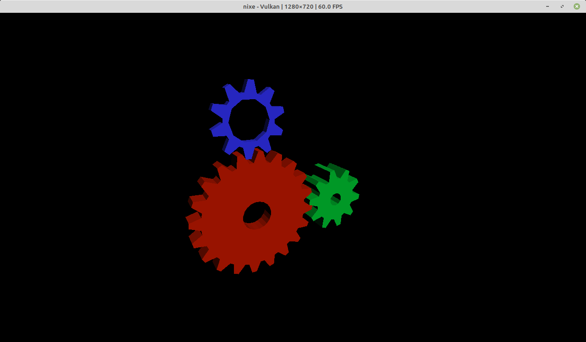
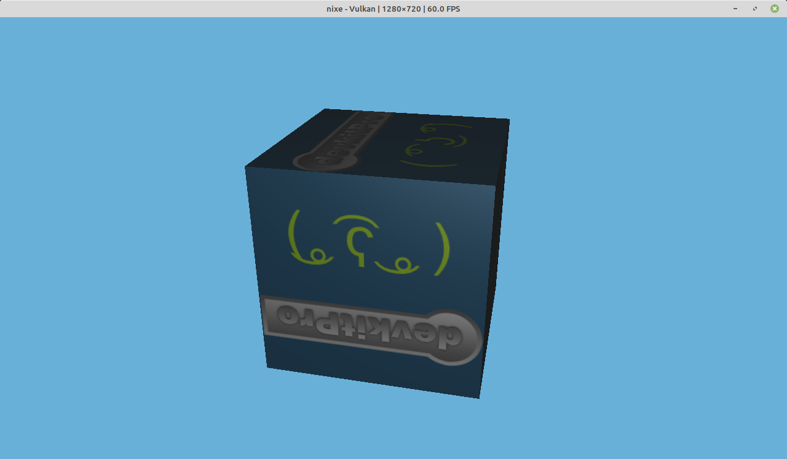

# Nixe

This is an educational and experimental project written in Rust. Its long-term goal is to research and build
functional emulators for Nintendo Switch and Nintendo Switch 2 while sharing well-defined components between
both platforms whenever technically appropriate.

## Goals

- Study modern console emulation and low-level systems programming.
- Build a functional Nintendo Switch emulator incrementally.
- Prepare an extensible foundation for Nintendo Switch 2 research and emulation.
- Reuse CPU, memory, graphics, tooling, and other infrastructure when the underlying behavior is genuinely
  shared.
- Favor testable, documented, and maintainable Rust code.

## Project Status

The project is in active development. Some homebrew applications run at up to 60 FPS, and gamepad input is
supported through the emulated HID services.

### Screenshots

<table>
  <tr>
    <td></td>
    <td></td>
  </tr>
</table>

## JIT compiler

Nixe translates guest AArch64 with [Dynarmic](https://github.com/lioncash/dynarmic).
The original repository is vendored in `vendor/dynarmic`, pinned to commit
`a41c380246d3d9f9874f0f792d234dc0cc17c180`, including its bundled dependencies
and licenses. Cargo builds its A64 frontend, host backend and the C++ bridge
automatically.

Each virtual CPU owns a native code cache, block links, register allocator and
return prediction. The process shares memory and the exclusive monitor. Fastmem
uses nixe's direct arena and signal capture; memory ownership, invalidation,
scheduler interrupts, SVCs and architectural state remain connected to the
runtime. Unsupported instructions stop explicitly rather than falling back to
the interpreter. The interpreter remains available as a separate CPU backend.

Building requires a C++20 compiler, CMake and Boost headers, in addition to the
Rust toolchain and existing graphics/audio dependencies. On Debian/Ubuntu these
are provided by `build-essential cmake libboost-dev`. Native dependencies are
built from the vendored tree; no CMake download step is required. The small
upstream adaptations are listed in [UPSTREAM.txt](vendor/dynarmic/UPSTREAM.txt).

## Running

See [host requirements](docs/host-requirements.md) for required CPU and memory
capabilities. `--offline` is optional once dependencies are cached.

The default configuration is in [`nixe.toml`](nixe.toml). Window size and
position are remembered in a versioned binary `nixe.cfg` beside the selected
`nixe.toml`; it is managed by Nixe.

List available titles with:

```bash
cargo cli list
```

Run a title by its ID or name:

```bash
cargo cli run <id | name>
```

With the game window focused, press **S** to save a PNG to
`dump/screenshots/nixe/<title>-<UTC timestamp>.png` (relative to the working
directory). Captures copy the next presented framebuffer at its native cropped
resolution, applying its display orientation without filtering or window scaling.
RGB bytes are preserved; internal framebuffer alpha is omitted, as in window
presentation. GPU readback and background PNG writing happen only on request;
holding S does not produce repeated captures. The log reports the saved path or
an error. Press **1** to resize the window to the frame's native resolution.

## Testing

Run

```
cargo test-all
```

### GPU tests

GPU execution tests require a physical GPU; software rasterizers are excluded.
When no physical GPU is available they print `SKIP:` (visible with `--nocapture`)
and return. The standard Rust harness labels these returns `ok`, so they must
not be counted as hardware validation. Errors after GPU initialization remain
test failures. Opt-in native tests and their additional requirements are described
in [the native interop test guide](crates/gpu-wgpu/tests/native_interop/README.md).

### Integration tests against real titles

To run integration tests against caller-owned titles, copy `.env.integration.example` to
`.env.integration`, configure the paths, and run `./scripts/test-integration.sh`.

### Differential tests

Optional CPU differential tests require QEMU user-mode (`qemu-aarch64`), the Rust
`aarch64-unknown-linux-gnu` target, and its cross-linker.

```bash
sudo apt update && sudo apt install qemu-user gcc-aarch64-linux-gnu
rustup target add aarch64-unknown-linux-gnu
```

Verify with

```bash
qemu-aarch64 --version
aarch64-linux-gnu-gcc --version
```

Then run

```bash
cargo test-diff
```

To run a fast, focused A64 differential test for one instruction family or coverage ID, use:

```bash
NIXE_DIFF_FAMILY=simd-duplicate-element cargo test-diff-a64
NIXE_DIFF_COVERAGE_ID=0x8c cargo test-diff-a64
```

### Fuzz tests

CPU decoder and memory fuzz targets require a nightly Rust toolchain
and `cargo-fuzz`:

```bash
rustup toolchain install nightly
cargo install cargo-fuzz
cargo fuzz-all
```

See [fuzz/README.md](fuzz/README.md) for target-specific commands and configuration.

## Contributing

See [CONTRIBUTING.md](CONTRIBUTING.md).

## Legal Notice

This project is intended for lawful education, research, interoperability, and preservation work. It does not
provide or distribute games, firmware, cryptographic keys, copyrighted console files, or leaked confidential
material.

Users and contributors are responsible for complying with the laws applicable in their jurisdictions and for
using only software and data they are legally entitled to use.

Nintendo Switch and Nintendo Switch 2 are trademarks of Nintendo. This project is independent and is not
affiliated with, sponsored by, or endorsed by Nintendo or NVIDIA.

## License

Nixe is licensed under the GNU General Public License version 3 or later. See [LICENSE.txt](LICENSE.txt).
