# Rendering a Frame in a Switch 1 Graphics Emulator

This document describes how one rendered frame travels from a title's graphics
API calls to a visible image on the host display. It is a technical reference
for implementing and reviewing the graphics path.

The description follows a GPU-rendered path using OpenGL, NVN, or a similar
guest graphics library. A CPU software renderer uses the same presentation
path; it replaces only the Maxwell image-production stage.

## 1. Complete path

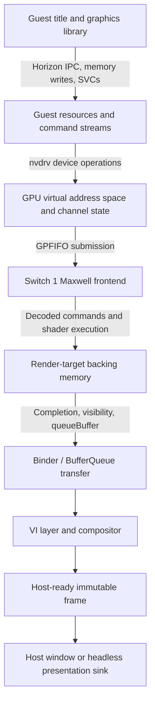

The GPU frontend produces or updates an image. VI and the compositor do not
execute Maxwell commands; they consume a completed image according to display
layer, queue, and synchronization rules.

## 2. Actors and responsibilities

| Actor                       | Responsibility                                                                    |
| --------------------------- | --------------------------------------------------------------------------------- |
| Title                       | Builds scene data and requests draws through a guest graphics API.                |
| Guest graphics library      | Allocates resources, prepares shaders, descriptors, and command streams.          |
| Horizon IPC and SVC layer   | Transports requests, manages handles, mappings, events, waits, and threads.       |
| `nvdrv`                     | Exposes the Switch-facing NVIDIA device ABI and session semantics.                |
| `nvmap`                     | Gives shared allocations an NVIDIA-visible identity and lifetime.                 |
| GPU address-space manager   | Maps allocations into a guest GPU virtual address space.                          |
| GPU channel                 | Owns submission state and accepts GPFIFO work.                                    |
| Maxwell frontend            | Decodes packets, updates GPU state, resolves resources, and emits GPU operations. |
| GPU backend                 | Executes validated operations using a host GPU or reference implementation.       |
| Synchronization coordinator | Relates host completion, memory visibility, guest syncpoints, and fences.         |
| Binder / BufferQueue        | Transfers buffer-slot ownership between producer and compositor.                  |
| VI                          | Owns displays, layers, scaling, visibility, stacking, and VSync events.           |
| Compositor                  | Selects completed layer images and produces host-ready frames.                    |
| Host presenter              | Uploads or copies host-ready frames to the native window.                         |

Identifiers must not cross domains implicitly. A GPU virtual address is not an
`nvmap` handle, a syncpoint is not a host fence, and a BufferQueue slot is not a
render-target resource.

## 3. Frame lifetime and ownership

One frame normally uses a rotating set of image slots:

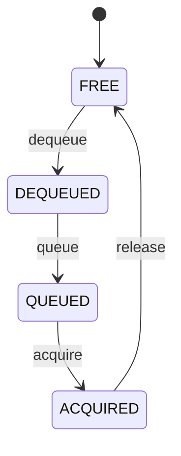

The producer may write only a `DEQUEUED` slot. The compositor may read only an
`ACQUIRED` slot. A queued image cannot be reused until the consumer releases it.

Storage and interpretations have different lifetimes:

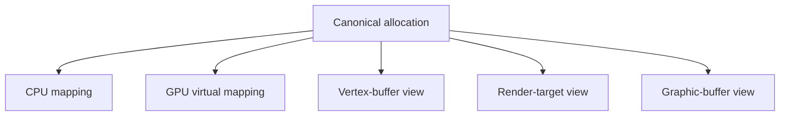

Destroying a view does not destroy its allocation. Unmapping a GPU address does
not invalidate bytes already retained by an in-flight submission. Such a
submission retains a versioned backing reference, never a raw CPU or host
pointer.

## 4. Establishing the display connection

The title opens a VI root service, normally `vi:u` for an application. The
request crosses the guest Horizon boundary:


The SVC and IPC layers carry the request; they do not interpret pixels or GPU
commands.

The title opens the default display, creates or obtains a layer, and sets size,
position, visibility, scaling, transform, alpha, and stacking order. The layer
returns native-window data containing the Binder relay and producer identity.

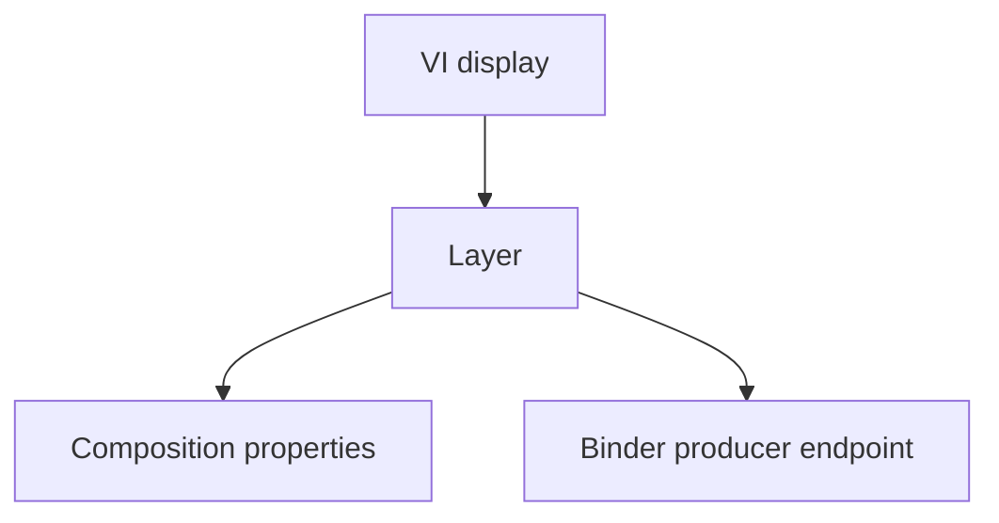

The producer endpoint configures buffers, dequeues slots, and queues completed
images. VI decides where the layer is composed, not how its pixels are made.

## 5. Opening `nvdrv` and discovering the GPU

The guest graphics stack opens the NVIDIA service through Horizon. Although the
guest API resembles file descriptors and ioctls, requests are transported by
Horizon IPC:

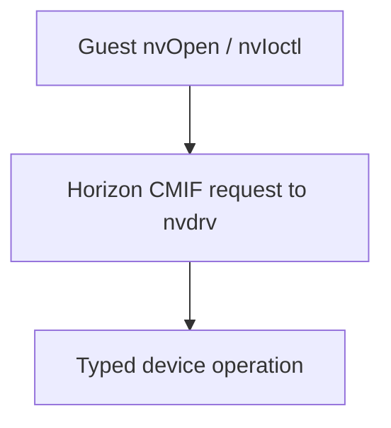

Typical devices are:

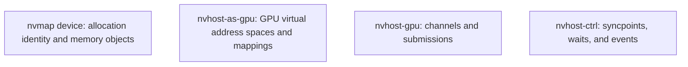

Discovery establishes one consistent hardware profile: architecture and class
identifiers, GPC/TPC topology, page sizes, GPU virtual-address width, shader
capabilities, engine capabilities, and synchronization limits. Discovery
determines how later requests are validated; it does not draw.

## 6. The memory model

Graphics memory has explicit address domains:

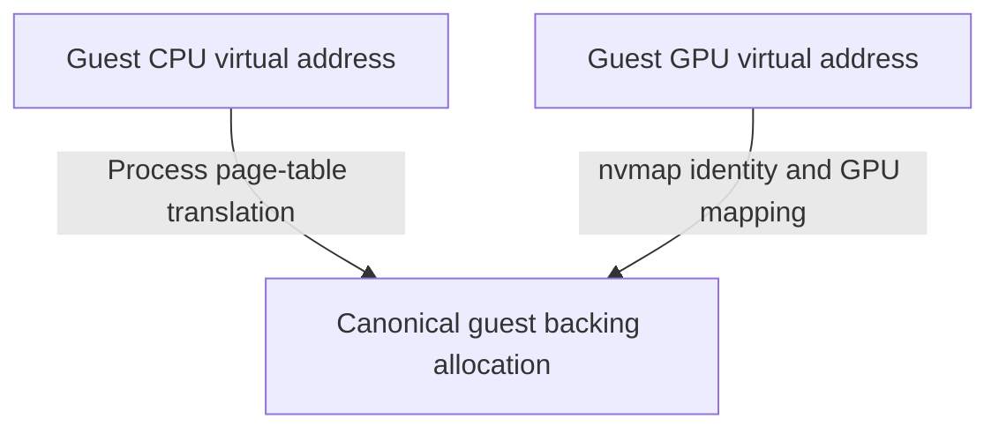

CPU-written vertices and a GPU command can refer to the same bytes:

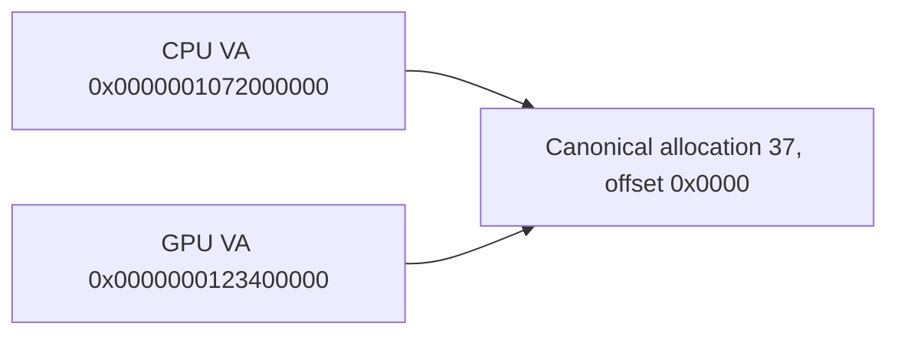

Neither guest address is a host pointer. Resolution always goes through the
owning process or GPU address-space tables.

### 6.1 `nvmap` objects

An `nvmap` object gives an allocation an NVIDIA-facing identity and lifetime.
It refers to size, alignment, canonical backing ranges, cache and heap flags,
ownership, imported references, and allocation or mapping generations.

The object is not itself a texture, buffer, or render target. Those are views
over ranges of the allocation.

### 6.2 GPU mappings

The GPU address-space manager maps an `nvmap` allocation into a GPU virtual
address range:

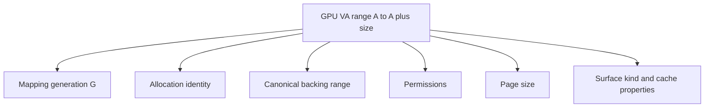

Mapping operations validate alignment, bounds, overlap, permissions, page size,
object ownership, and generation. A command referencing an unmapped or stale
range fails before host memory is accessed.

### 6.3 Visibility and cache ordering

A byte write and an address-space remap are different events, so they use
different generations or visibility versions.

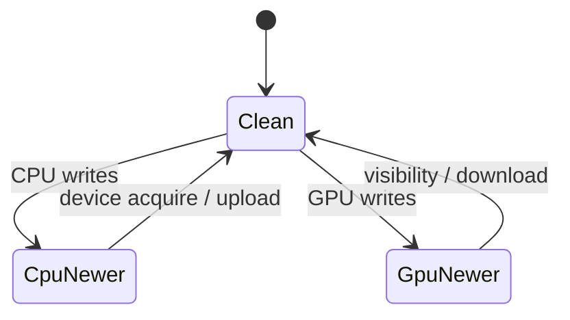

A host backend may use device-local resources, staging buffers, or unified
memory. The guest-visible rule is that a consumer observes writes only after
the required visibility transition completes.

## 7. Creating draw resources

Guest OpenGL/NVN calls execute guest code. A call such as `DrawArrays` does not
directly invoke a host draw call. The guest graphics stack turns it into
resources and commands.

A simple triangle needs at least:

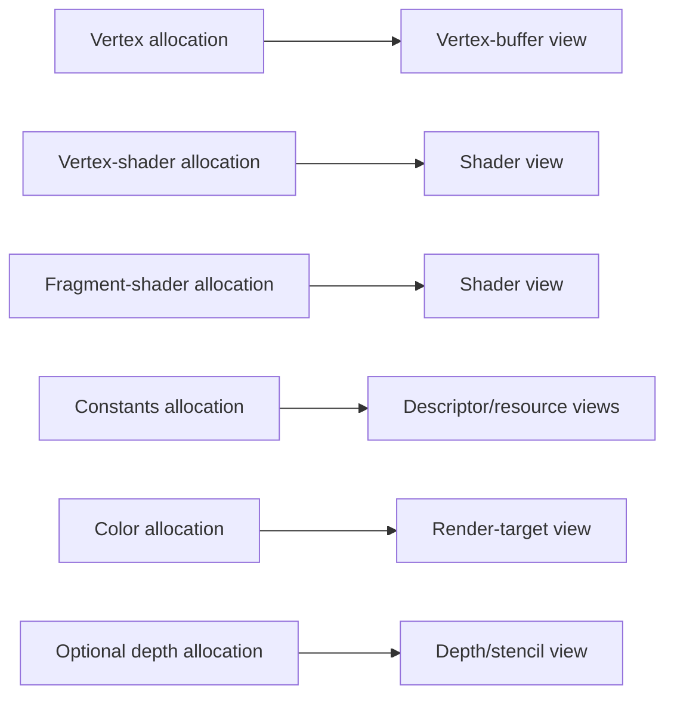

Views carry interpretation metadata: buffer offset and size, image format,
dimensions, mip levels, sample count, pitch or block-linear layout, plane
offsets, surface kind, and access permissions.

Every view resolves to canonical backing ranges when consumed. A cached host
resource must be invalidated or updated when an aliased view writes the same
backing bytes.

## 8. Shaders and pipeline state

The guest graphics stack compiles, links, uploads, or selects shaders. The
shader code eventually exists in guest memory in the Switch GPU instruction
format.

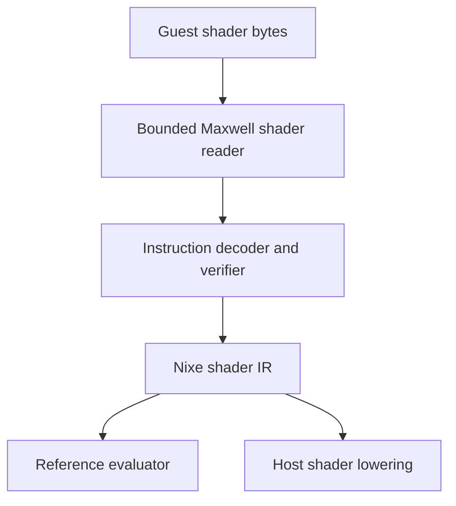

The decoder validates instruction boundaries, control-flow targets, register
use, stage information, and resource references before lowering. The IR
preserves numeric widths, signedness, rounding, predicates, register and local
memory access, textures, stage interfaces, barriers, and special values.

Pipeline state combines shader stages with fixed-function state:

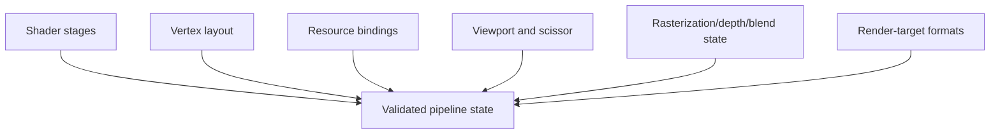

## 9. Building and submitting GPU commands

The guest graphics stack writes Maxwell command words into guest memory. They
are referenced through GPFIFO entries:

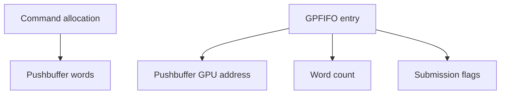

Submitting through `/dev/nvhost-gpu` performs the following operations:

1. Validate the channel and its ownership.
2. Validate GPFIFO counts, sizes, flags, and address arithmetic.
3. Resolve each GPFIFO address through the channel's GPU address space.
4. Retain mapping generations and backing ranges needed by the work.
5. Establish CPU-to-GPU visibility for commands and resources.
6. Assign a frontend submission identity.
7. Schedule the submission according to channel ordering rules.

The frontend retains typed mapping references until completion and visibility.
It does not retain a CPU virtual address or host pointer as a substitute.

## 10. Decoding Maxwell pushbuffers

The Maxwell frontend reads validated pushbuffer words and decodes packet
encodings into method operations:

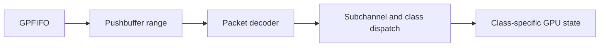

Packet decoding and execution are separate stages:

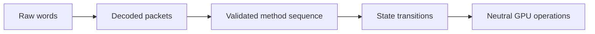

The decoder validates packet type and length, method range, subchannel,
increment mode, class binding, and word availability across mapping boundaries.
Class dispatch additionally checks that a method is valid for the bound class and
hardware profile.

Some class methods invoke Maxwell Macro Method Expander microcode rather than
changing 3D state directly. The MME consumes call parameters and existing
register state, then emits ordinary Maxwell methods back into the same validated
dispatch path. See [Maxwell Macro Method Expander (MME)](Macro%20Method%20Expander%20%28MME%29.md)
for its execution and memory model.

Unknown packet encodings, unsupported classes, and unsupported methods are
distinct diagnostics. Source context should include channel, submission, GPFIFO
entry, pushbuffer GPU address, word offset, class, method, and mapping
generation.

## 11. Executing the draw

The 3D class accumulates state until a clear or draw has enough information:

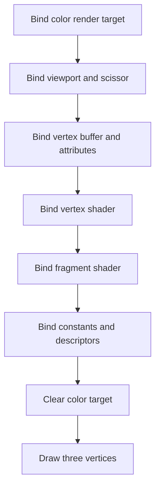

The frontend resolves every resource through the GPU address space and emits
host-independent operations:

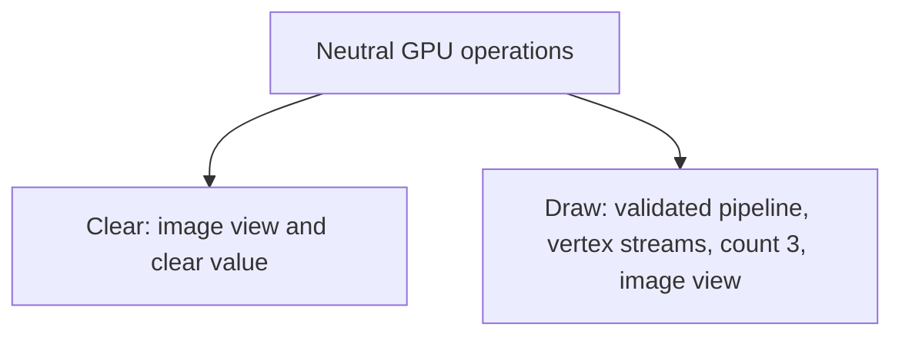

The neutral operation layer contains neither Horizon ioctl numbers, Binder
objects, Maxwell packet words, nor host graphics objects.

For each vertex, the vertex stage reads attributes, applies the vertex shader,
produces a clip-space position, and produces values for later stages. Clipping,
perspective division, viewport mapping, rasterization, interpolation,
depth/stencil, blending, and the fragment shader determine the final color
target writes.

Those writes change the visibility state of the canonical render-target backing:

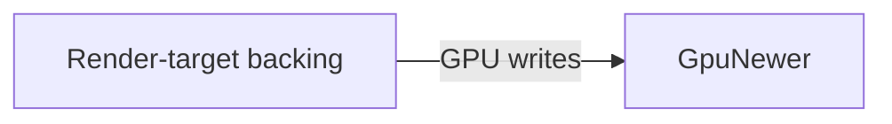

The result is not guest-visible merely because a host command encoder accepted
the operation.

## 12. Backend execution and completion

The backend receives neutral operations after guest semantics have been
validated:

```mermaid
flowchart TD
    A[Neutral operations] --> B[Backend resource and pipeline translation] --> C[Host command submission] --> D[Host completion token]
```

Completion has distinct stages:

```mermaid
flowchart TD
    A[Frontend accepted] --> B[Backend completed] --> C[Declared GPU writes visible to guest memory] --> D[Guest syncpoint advanced] --> E[Guest fence or wait becomes satisfiable]
```

A backend token is not a guest syncpoint. Host queue completion is not
automatically guest memory visibility. A completed GPU submission is not a
BufferQueue acquire fence, and a satisfied GPU fence is not a VSync event.

If a GPU write must be downloaded from a host resource, that download and the
canonical-memory visibility transition occur before the guest syncpoint becomes
observable.

## 13. Preparing the display buffer

The render target becomes displayable through a graphic-buffer description:

```mermaid
flowchart TD
    A[Graphic buffer] --> B[Allocation identity]
    A --> C[Width and height]
    A --> D[Pixel format]
    A --> E[Pitch]
    A --> F[Plane offsets and sizes]
    A --> G[Linear or block-linear layout]
    A --> H[Surface kind]
    A --> I[Transform and crop]
    A --> J[Acquire/release fence metadata]
```

The same allocation may have different views for GPU rendering and display
composition. The display view preserves the negotiated format and layout.

For a block-linear surface, the compositor performs a layout calculation rather
than treating the allocation as a row-major array:

```mermaid
flowchart TD
    A[Display pixel (x, y)] --> B[Surface layout calculation] --> C[Backing byte offset]
```

Any conversion to a host-ready linear image occurs at this explicit boundary
and accounts for format, pitch, planes, block height, kind, crop, and transform.

## 14. Binder and BufferQueue

The title communicates with the producer endpoint through Binder transactions:

```mermaid
sequenceDiagram
    participant P as Producer
    participant C as Consumer
    P->>C: dequeueBuffer(slot)
    Note over P: Wait for acquire dependencies
    Note over P: Render into slot
    P->>C: queueBuffer(slot, metadata, fence)
    C->>C: Acquire buffer and wait for fence
    C->>C: Compose image
    C-->>P: releaseBuffer(slot)
```

The queue owns state transitions and its availability event. A successful
Binder transaction is not a successful state transition unless the slot,
ownership, metadata, and fence are valid.

Invalid transitions include queuing a free slot, dequeuing an already dequeued
slot, acquiring a non-queued slot, releasing a non-acquired slot, and reusing a
slot before its release.

The queue transfers ownership. It should not silently copy a full image for
each transaction; copying or layout conversion belongs to an explicit
composition or readback step.

## 15. VI composition and VSync

When the compositor can acquire a completed buffer, it associates it with the
VI layer and applies visibility, position, scaling, transform, alpha, crop, and
z-order.

GPU completion and display timing are independent:

```mermaid
flowchart TD
    A[GPU completion] --> C[Queued image]
    B[VSync boundary] --> C
    C --> D[Latched layer image]
```

If the GPU finishes before a refresh boundary, the image may be latched at
that boundary. If it finishes afterward, it waits for a later one. A host
window refresh event must not replace the guest VI VSync event.

## 16. Host-ready frame and final presentation

The compositor converts the selected guest image into immutable presentation
data:

```mermaid
flowchart TD
    A[Guest graphic buffer] --> B[Resolve canonical backing] --> C[Wait for acquire dependencies]
    C --> D[Decode format and layout] --> E[Apply crop and transform] --> F[Compose layer] --> G[Immutable host-ready frame]
```

A host-ready frame contains dimensions, format, sequence, and immutable pixel
storage. It does not expose guest handles, GPU addresses, Binder objects,
runtime events, or host graphics objects to the window-system layer.

The host presenter owns the native window and host graphics API:

```mermaid
flowchart TD
    A[Host-ready frame] --> B[Host texture or upload buffer] --> C[Fullscreen presentation primitive] --> D[Native window surface]
```

The presenter may resize, letterbox, or scale the image to fit the host window.
It must not modify guest layer state or guest render-target memory, and it must
not advance guest GPU syncpoints.

## 17. Software-rendered images

A CPU software renderer follows the same path after image production:

```mermaid
flowchart LR
    A[CPU stores pixels] --> B[Guest image-layout conversion] --> C[Cache visibility transition] --> D[queueBuffer] --> E[VI/compositor] --> F[Host-ready frame] --> G[Host window]
```

No Maxwell channel, pushbuffer, shader decoder, or 3D engine is required. The
producer still needs a valid graphic-buffer description, BufferQueue ownership,
fences, and display timing.

This gives a useful debugging split:

```mermaid
flowchart TD
    A[Wrong pixels before queueBuffer] --> A1[Memory, GPU, shader, or layout]
    B[Wrong slot transition] --> B1[Binder/BufferQueue]
    C[Correct queued image, wrong layer] --> C1[VI/compositor]
    D[Correct host-ready frame] --> D1[Host presenter]
```

## 18. Diagnostics and invariants

Every accepted operation has one of three outcomes:

1. verified guest-visible semantics;
2. a verified guest-visible error for invalid guest state or arguments; or
3. a typed emulator diagnostic identifying missing semantics.

Diagnostics should identify the narrowest failed boundary: service command,
device open, `nvmap` ioctl, GPU mapping, GPFIFO entry, pushbuffer packet,
Maxwell method, shader instruction, resource format, backend capability,
BufferQueue transition, or composition operation.

Useful bounded, pointer-free context includes process, file descriptor,
allocation, mapping generation, channel, submission, GPU address, packet offset,
class, method, syncpoint, slot, and frame sequence.

An unknown GPU method must not become a no-op, and an incomplete backend
submission must not become an already-signaled guest fence.

## 19. End-to-end summary

```mermaid
flowchart TD
    A[1. Open VI and create display layer] --> B[2. Obtain Binder producer endpoint]
    B --> C[3. Open nvdrv devices] --> D[4. Query GPU profile]
    D --> E[5. Register allocations with nvmap] --> F[6. Map allocations into GPU VA]
    F --> G[7. Write vertices, descriptors, constants, shaders and images]
    G --> H[8. Build Maxwell pushbuffers and GPFIFO entries]
    H --> I[9. GPU channel accepts validated submission]
    I --> J[10. Maxwell produces neutral clear/draw operations]
    J --> K[11. Backend executes operations] --> L[12. Establish completion and visibility]
    L --> M[13. Guest syncpoints and fences become observable]
    M --> N[14. Describe render target as graphic buffer]
    N --> O[15. Dequeue BufferQueue slot] --> P[16. Queue slot through Binder]
    P --> Q[17. Compositor acquires after fence] --> R[18. VI applies layer at refresh]
    R --> S[19. Create immutable host-ready frame] --> T[20. Presenter displays frame]
```

The central invariant is that every transition is explicit: address
translation, resource interpretation, command execution, completion, memory
visibility, slot ownership, composition, and host presentation are represented
by the layer that owns their semantics.
